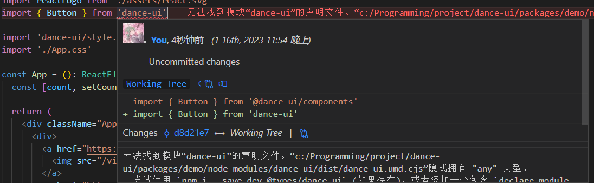
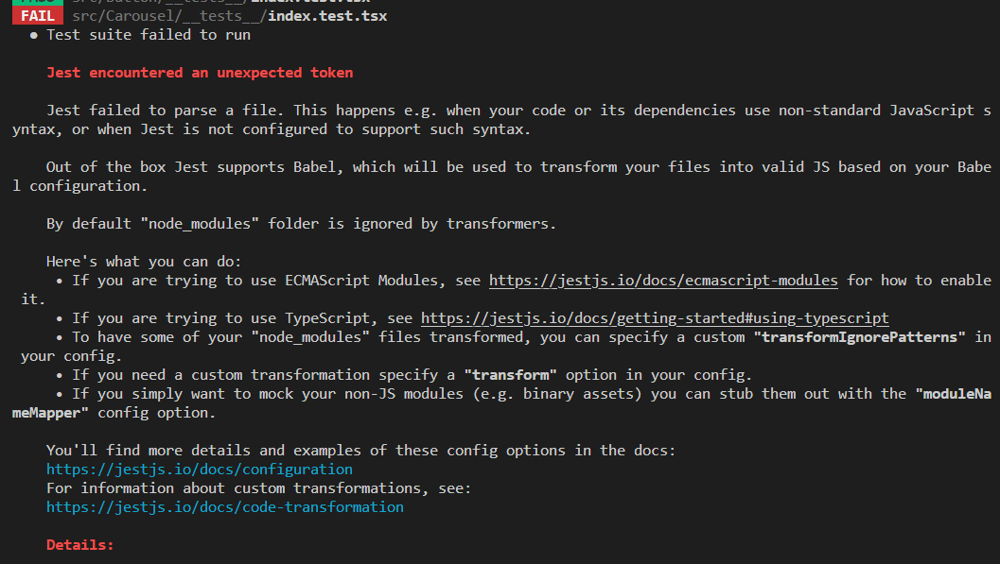

# bug 回忆录

## Prettier 格式化未生效

[Support .prettierrc.js when type module is used in package.json #12701](https://github.com/prettier/prettier/issues/12701)

将 .prettierrc.js 改为 .prettierrc.cjs 即可

## ESLint 运行报错

[javascript - Error while loading rule &#39;@typescript-eslint/dot-notation&#39; - Stack Overflow](https://stackoverflow.com/questions/64116378/error-while-loading-rule-typescript-eslint-dot-notation)

### React

React 18 会自动导入

[reactjs - 使用 JSX react/react-in-jsx-scope 时，&#39;React&#39; 必须在范围内吗？ - 堆栈溢出 (stackoverflow.com)](https://stackoverflow.com/questions/42640636/react-must-be-in-scope-when-using-jsx-react-react-in-jsx-scope)

## vite 打包组件库时出现了无法从 `node_modules` 的包中推断类型的错误

[vite-plugin-dts/README.zh-CN.md at main · qmhc/vite-plugin-dts (github.com)](https://github.com/qmhc/vite-plugin-dts/blob/main/README.zh-CN.md#%E6%89%93%E5%8C%85%E6%97%B6%E5%87%BA%E7%8E%B0%E4%BA%86%E6%97%A0%E6%B3%95%E4%BB%8E-node_modules-%E7%9A%84%E5%8C%85%E4%B8%AD%E6%8E%A8%E6%96%AD%E7%B1%BB%E5%9E%8B%E7%9A%84%E9%94%99%E8%AF%AF)



## CI 错误 remote: Permission to git denied to github-actions [bot]

[remote: Permission to git denied to github-actions[bot]. #96](https://github.com/ad-m/github-push-action/issues/96)

换成 git token 或提升权限

## Cannot read properties of null (reading 'useCallback')

react_devtools_backend.js:4012
Warning: Invalid hook call. Hooks can only be called inside of the body of a function component. This could happen for one of the following reasons:

1. You might have mismatching versions of React and the renderer (such as React DOM)
2. You might be breaking the Rules of Hooks
3. You might have more than one copy of React in the same app

react.development.js?6237:1646
Uncaught TypeError: Cannot read properties of null (reading 'useCallback')
at useCallback (react.development.js?6237:1646:1)
at Icon (dance-ui.es.js?b4ad:953:1)

- [警告：非法 Hook 调用 – React (reactjs.org)](https://zh-hans.reactjs.org/warnings/invalid-hook-call-warning.html#duplicate-react) 将组件库的 React 和 react-dom 版本换到 和文档站一样的就 ok 了

```bash
pnpm upgrade react@^17.0.2 -w
pnpm upgrade react-dom@^17.0.2 -w
```

## ReferenceError: window is not defined

文档站打包时报错：

```bash
[ERROR] Docusaurus server-side rendering could not render static page with path /docs/components/Icon.

ReferenceError: window is not defined
ReferenceError: Cannot access 'IconNames' before initialization
[ERROR] Unable to build website for locale zh-Hans.
[ERROR] Error: Failed to compile with errors.
```

原因是直接引入的 iconfont.js 中使用了 window，改为挂载后再使用

```typescript
// ...
useMount(() => {
  import('./script/iconfont.js' as any)
  console.log('mounted')
})
```

## Jest 引入 loadsh-es 时出错


